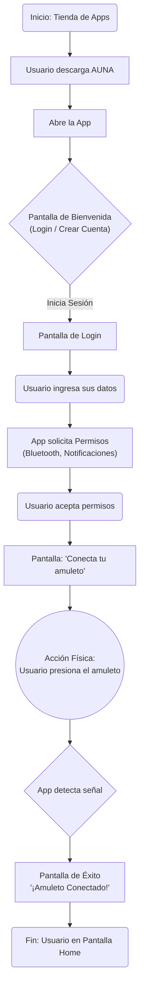

# 🪷 AUNA

**Proyecto por [@janisepulveda](https://github.com/janisepulveda)**

## 📖 Acerca de

**AUNA** es un proyecto de diseño y tecnología inspirado en la neuralgia del trigémino, una enfermedad crónica caracterizada por un dolor intenso pero invisible.

El sistema combina un **amuleto portátil** con una **aplicación móvil** para registrar y visualizar experiencias de dolor.  

Con un **toque**, el amuleto permite registrar una crisis, indicando en la app:  

- Intensidad del dolor (escala de 1 a 10).  
- Duración en segundos.  
- Notas opcionales.  

La aplicación organiza esta información en un calendario y la traduce en un **espacio visual vivo**, inspirado en los jardines: su crecimiento continuo, sus ciclos de apertura y recogimiento, y su imperfección natural.  

Onboarding:


## 🛠️ Stack tecnológico

Estamos usando:

- [ESP32-C3 Super Mini](https://es.aliexpress.com/item/1005007205044247.html)  
- [ESP-IDF / documentación oficial](https://docs.espressif.com/projects/esp-idf/en/stable/esp32c3/get-started/index.html)  
- [Arduino IDE 2.0](https://www.arduino.cc/en/software) para desarrollo con microcontroladores.  
- [Flutter](https://flutter.dev/) para desarrollo de la app móvil.

Sensores y componentes en exploración:  

- Botón físico.  
- Sensor capacitivo (touch).  
- Resistencia de presión (FSR), usada en modo binario y para rangos de dolor.  
- Motor vibrador (retroalimentación háptica).

## ⚙️ Instalación para desarrollar

### 1️⃣ Configuración del ESP32-C3 (Firmware)

**Requisitos:**

- Arduino IDE 2.0 o superior  
- Driver del ESP32-C3 Super Mini (si tu sistema lo requiere)  
- Cable USB para conectar la placa  

**Pasos:**  

1. Abrir **Arduino IDE**.  
2. Ir a **Archivo → Preferencias** y agregar esta URL en “Gestor de URLs Adicionales de Placas”: 

   ```
   https://raw.githubusercontent.com/espressif/arduino-esp32/gh-pages/package_esp32_index.json
   ```

3. Abrir **Herramientas → Placa → Gestor de Placas**, buscar `esp32 by Espressif Systems` e instalar.  
4. Seleccionar la placa: **Nologo ESP32C3 Super Mini**  
`Herramientas → Placa → ESP32C3 Dev Module / Nologo ESP32C3 Super Mini`
5. Seleccionar el puerto correcto:  
` Herramientas → Puerto → `/dev/cu.usbserial…` (Mac/Linux) o equivalente en Windows`
6. Subir el código de ejemplo de este repositorio: [`/arduino/ble_server.ino`](arduino/ble_server.ino)

🔹 Este código de ejemplo **le da el nombre `Auna` a la placa**, que será usado posteriormente por la app Flutter para conectarse automáticamente al dispositivo BLE.

⚠️ Nota: Esta placa soporta **BLE**, pero no Bluetooth clásico. Si aparece:

```cpp
#error Bluetooth is not enabled! Please run `make menuconfig` to enable it
```

es normal, BLE sí funciona.

### 2️⃣ Configuración del entorno Flutter (App móvil)

**Requisitos:**  

- Flutter SDK ([flutter.dev](https://flutter.dev/docs/get-started/install))  
- Android Studio (para emulador o despliegue en Android)  
- Xcode si quieres compilar en iOS
- Editor de código: VSCode o Android Studio recomendado  

**Pasos:**

1. Instalar **Flutter SDK** y agregarlo al PATH.
2. Verificar instalación: `flutter doctor`
3. Ir al directorio del proyecto en la terminal: `cd ruta/al/proyecto/flutter`
4. Abrir el proyecto con Visual Studio Code `code .`
5. Instalar dependencias: ´flutter pub get´
6. Conectar un dispositivo físico o iniciar un emulador.
7. Correr la app: `flutter run`
8. La app buscará automáticamente el dispositivo BLE llamado `Auna` y se conectará.

## 📚 Bibliotecas y recursos Flutter

En el proyecto usamos las siguientes bibliotecas y referencias:  

- [flutter_reactive_ble](https://pub.dev/packages/flutter_reactive_ble) – Manejo de BLE en Flutter.  
- [permission_handler](https://pub.dev/packages/permission_handler) – Manejo de permisos en Android/iOS.  
- [shared_preferences](https://pub.dev/packages/shared_preferences) – Almacenamiento local simple.  
- [dart:async](https://api.flutter.dev/flutter/dart-async/) – Librería oficial de Dart para programación asíncrona y streams.
- [dart:convert](https://dart.dev/libraries/dart-convert) – Librería oficial de Dart para conversión de datos (UTF8, JSON, etc).
- [dart:io](https://api.dart.dev/stable/dart-io/dart-io-library.html) – Librería oficial de Dart para operaciones de entrada/salida.
- [dart:math](https://dart.dev/libraries/dart-math) – Librería oficial de Dart para operaciones matemáticas.
- 

## 🚀 Estado del proyecto

Actualmente en etapa de **prototipado**:

- Servidor BLE básico en ESP32-C3 funcionando.  
- Conexión establecida desde Flutter (Android/iOS).  
- Próximos pasos: enviar valores reales de sensores (botón, capacitivo, FSR) en lugar de texto fijo.  
- Prototipos físicos en **impresión 3D** explorando distintos formatos: broche, collar y pulsera.  

## Comentarios

Probamos los códigos de BluetoothSerial y arrojaron errores del estilo

```cpp
#error Bluetooth is not enabled! Please run`make menuconfig`to and enable it
```

Esto nos lleva a creer que este chip en particular, en esta dev board, no tiene Bluetooth clásico, pero sí BLE.

## Licencia

Este proyecto está bajo la Licencia MIT.
