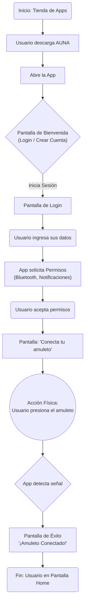
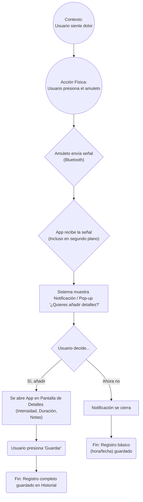

# Diagramas de Flujo de la App AUNA

Este documento contiene los flujos de usuario principales para la aplicación AUNA, que ayuda a registrar episodios de dolor a través de un dispositivo complementario (amuleto).

1. Flujo de Onboarding

Este flujo describe el proceso desde que un usuario descarga la app por primera vez hasta que conecta su amuleto y llega a la pantalla de inicio (Home), listo para usar.

2. Flujo de Registro de Episodio de Dolor

Este diagrama muestra cómo la aplicación registra un episodio de dolor cuando el usuario presiona el amuleto, incluso si la app está en segundo plano.

Consideraciones Adicionales

Flujos Pendientes: Sería útil diagramar otros flujos como la visualización del historial de dolor, la configuración de perfil y la gestión de permisos.

Manejo de Errores: Se deben considerar los casos de error, como la falla en la conexión Bluetooth o la pérdida de señal del amuleto.
