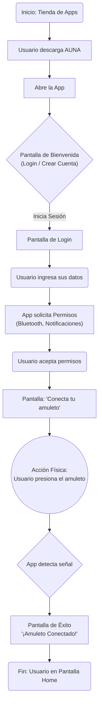
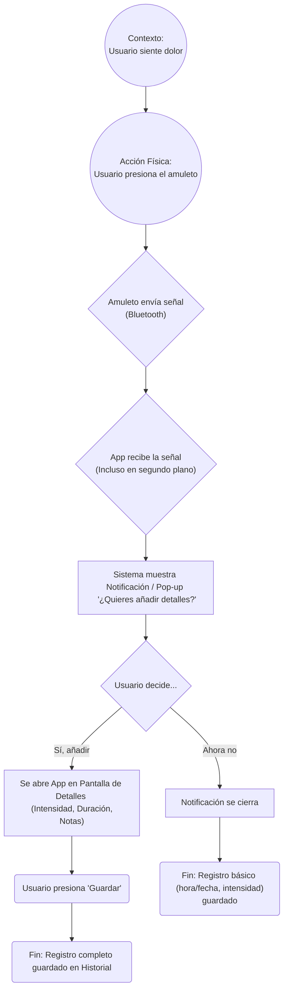

# esta carpeta contiene los diagramas de flujo de la app

Onboarding:

```mermaid
graph TD
    A("Inicio: Tienda de Apps") --> B["Usuario descarga AUNA"];
    B --> C["Abre la App"];
    C --> D{"Pantalla de Bienvenida <br> (Login / Crear Cuenta)"};
    D -- "Inicia Sesión" --> E["Pantalla de Login"];
    E --> F("Usuario ingresa sus datos");
    F --> G["App solicita Permisos <br> (Bluetooth, Notificaciones)"];
    G --> H("Usuario acepta permisos");
    H --> I["Pantalla: 'Conecta tu amuleto'"];
    I --> J(("Acción Física: <br> Usuario presiona el amuleto"));
    J --> K{"App detecta señal"};
    K --> L["Pantalla de Éxito <br> '¡Amuleto Conectado!'"];
    L --> M("Fin: Usuario en Pantalla Home");
```
Registro del episodio de dolor:

```mermaid
flowchart TD
    A(("Contexto: <br> Usuario siente dolor")) --> B(("Acción Física: <br> Usuario presiona el amuleto"))
    B --> C{"Amuleto envía señal <br> (Bluetooth)"}
    C --> D{"App recibe la señal <br> (Incluso en segundo plano)"}
    D --> E@{ label: "Sistema muestra Notificación / Pop-up <br> '¿Quieres añadir detalles?'" }
    E --> F{"Usuario decide..."}
    F -- Sí, añadir --> G["Se abre App en Pantalla de Detalles <br> (Intensidad, Duración, Notas)"]
    G --> H@{ label: "Usuario presiona 'Guardar'" }
    H --> I("Fin: Registro completo guardado en Historial")
    F -- Ahora no --> J["Notificación se cierra"]
    J --> K("Fin: Registro básico <br> (hora/fecha, intensidad) guardado")

    E@{ shape: rect}
    H@{ shape: rounded}
```
