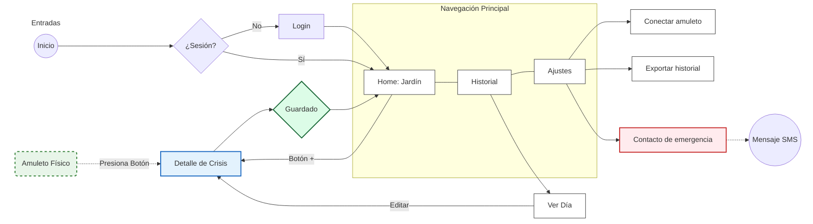
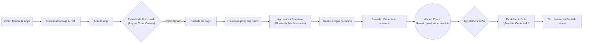
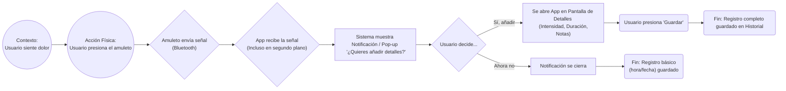

# Diagramas de Flujo de la App AUNA

Este documento describe los flujos de usuario principales de **AUNA**, una aplicación diseñada para registrar episodios de dolor mediante un dispositivo complementario (amuleto). Los diagramas a continuación ilustran los pasos desde el inicio de la app hasta la gestión de episodios de dolor.

---
## 1. Sistema de Organización y Navegación

Todas las pantallas que existen y cómo están conectadas entre sí.

## 2. Flujo de Onboarding

Este flujo muestra el proceso que sigue un usuario desde que descarga la aplicación hasta que conecta su amuleto y llega a la pantalla de inicio (Home).

## 3. Flujo de Registro de Episodio de Dolor

Este diagrama muestra cómo la aplicación registra un episodio de dolor cuando el usuario presiona el amuleto, incluso si la app está en segundo plano.

## 4. Flujo de registro manual

Este diagrama muestra cómo el usuario registra un episodio de dolor de forma manual en caso de no tener el amuleto.

```mermaid
flowchart LR
    A("Inicio: Pantalla Home") --> B@{ label: "Usuario presiona 'Registrar Episodio de Dolor'" }
    B --> C@{ label: "Abre Pantalla 'Detalle del Episodio'" }
    C --> D@{ label: "Usuario ajusta 'Intensidad'" }
    D --> E@{ label: "Usuario ajusta 'Fecha y Hora'" }
    E --> F@{ label: "Usuario ingresa 'Duración'" }
    F --> G@{ label: "Usuario escribe 'Notas'" }
    G --> H@{ label: "Usuario presiona 'Guardar Registro'" }
    H --> I("Fin: App regresa a Home")

    B@{ shape: rect}
    C@{ shape: rect}
    D@{ shape: rect}
    E@{ shape: rect}
    F@{ shape: rect}
    G@{ shape: rect}
    H@{ shape: rect}
```

Consideraciones Adicionales

Flujos Pendientes: Sería útil diagramar otros flujos como la visualización del historial de dolor, la configuración de perfil y la gestión de permisos.

Manejo de Errores: Se deben considerar los casos de error, como la falla en la conexión Bluetooth o la pérdida de señal del amuleto.
